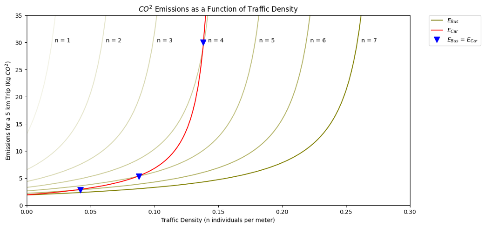

# Excecutive Public Summary
### Michael Croft, Jaden Chagnon....
##### Nov 16 2025
 

## The Climate Crisis 

Climate change has been cemented as an increasingly pressing issue in the lives of Canadians over the past decade. Wildfires, flooding, extreme storms, and glacier melt have been escalating due to the effects of climate change (Government of Canada 2025). Furthermore, the effects of climate change and global warming are predicted to worsen in the years to come. It is therefore crucial that we take steps in mitigating future climate damage to protect our natural resources and the health of the planet. Take the issue of personal transport. In Canada, personal vehicle use contributes 11% of total GHG emissions (Stiebert and Sawyer 2025). Strategies to decrease these GHGs in the personal transit industry would significantly impact Canada's carbon footprint. 

## The Electric Vehicle Issue 

Electric vehicles (EVs) have become a popular emissions-reducing alternative to gas powered personal vehicles. In recent years, Canada has adopted EV incentives, EV campaigns, and invested in charging port infrastructure across the country (Yakub 2025). Though EVs are a valuable clean-transportation tool, they are not a perfect solution. Though advertised as carbon-neutral, EVs may actually produce more GHG emissions than gas cars in certain scenarios. Electric vehicles are therefore a useful tool but cannot be the only solution to decreasing personal transport emissions. 

## Alternate Solutions

One solution to the personal transport GHG problem is public transit. Modelling carbon dioxide emissions of buses and cars shows that for seven bus occupants, bus emissions are always lower than car emissions. If the average bus occupancy in a given municipality at least seven (such as in Hamilton), taking the bus will always decrease carbon emissions (HCM 2024, Statistics Canada 2025). The more people who use public transit, the less emissions personal transportation will create (*Figure 1*). 

*Figure 1. Car emissions (red) versus bus emissions (green) with increasing number of bus occupants.*

Another solution is making informed decisions of when and where to charge an EV. It was mentioned that EVs are not always carbon neutral. The viability of EVs for green personal transport depends on the kind of energy provided by the grid (*Figure 2*). Therefore, you may be making a climate-forward or climate-backward decision in buying an EV, depending on how your province is powered. Knowing what kind of energy powers your province may inform whether investing in an EV decreases GHGs. 

*Figure 2. Map of Canada that highlights each Province and Territories infrastructure to sustain EV electricity consumption. Darker regions correspond to regions where EVs yeild lower emissions at any time of day, and lighter regions where EVs should be charged only at specific times, and may still contribute GHG emissions.*

## What should I do? 

Though it may feel as though individuals are helpless in the progression of climate change, there are individual lifestyle changes that can be made to mitigate GHG emissions. Something as simple as taking the bus to work or school in the morning, or ensuring your electrical grid is powered by renewable energy before buying an EV can make an impact. Though these changes may seem insignificant in the face of climate change as a whole, small, personal actions can change our relationship with the planet - one action at a time.  

### Works Cited 

    Government of Canada. 2025. “Climate change adaptation in Canada.” June 25. https://natural-resources.canada.ca/climate-change/climate-change-adaptation.

    HCM. 2024. “150 YEARS OF THE HSR.” Hamilton City Magazine, July 15. https://hamiltoncitymagazine.ca/150-years-of-the-hsr/.

    Statistics Canada. 2025. Number of Canadian Commuters Increases for Fourth Straight Year in 2025. https://www150.statcan.gc.ca/n1/en/daily-quotidien/250826/dq250826a-eng.pdf?st=Lug-A60z.

    Stiebert, and Sawyer. 2025. Early Estimate of National Emissions. Canadian Climate Institute. https://440megatonnes.ca/early-estimate-of-national-emissions/#estimate-table-2.

